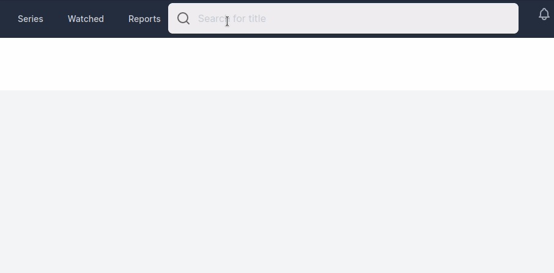
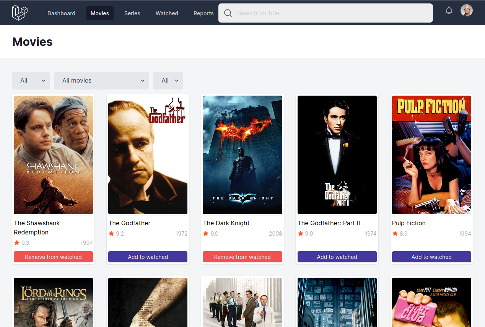
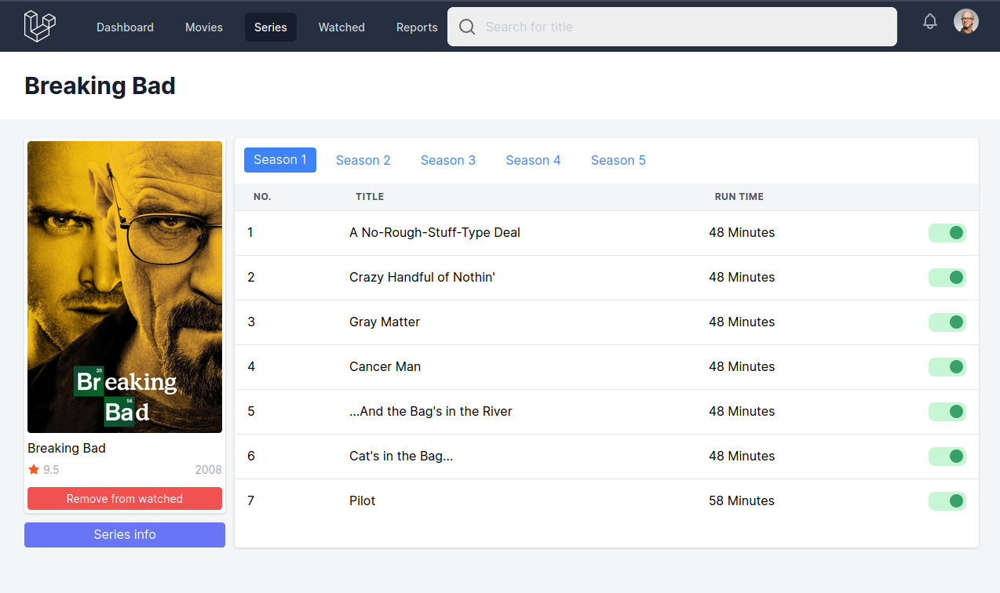

### iWatched

iWatched is movie, tv series tracker for personal usage. iWatched uses [imdb dataset](https://datasets.imdbws.com/). By a command it downloads all required datasets, unzips and imports to PostgreSQL database.

Import part is done by native PostgreSql command copy with Elquent query builder.

```php
public function start(): ImporterInterface
{
    $this->output->writeln('<info>Importing titles, may take some time</info>');

    DB::statement("COPY titles(tconst,title_type,primary_title,original_title,is_adult,start_year,end_year,runtime_minutes,genres) FROM '{$this->tsvPath}'");

    return $this;
}
```

### ElasticSearch

You can use abc tool to import titles table. After that you will get pretty fast search results.

```sh
abc import --src_type=postgres --src_filter=titles --src_uri="postgresql://postgres:<your-password>@127.0.0.1:5432>/<database-name>" "http://localhost:9200/titles"
```



You can also use some shortcuts to find desired title.

```sh
the gift :year 2000
```

```sh
tt0903747 :imdb
```

### Movies



### Series



### Commands

```sh
php artisan import:titles
```

You can skip tables.

```sh
php artisan import:titles --skip=title
```

Or import only given tables.

```sh
php artisan import:titles --only=rating
```
